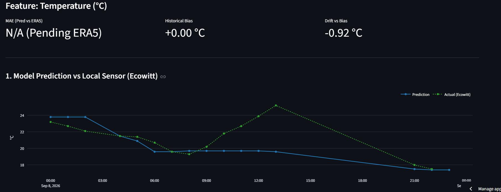
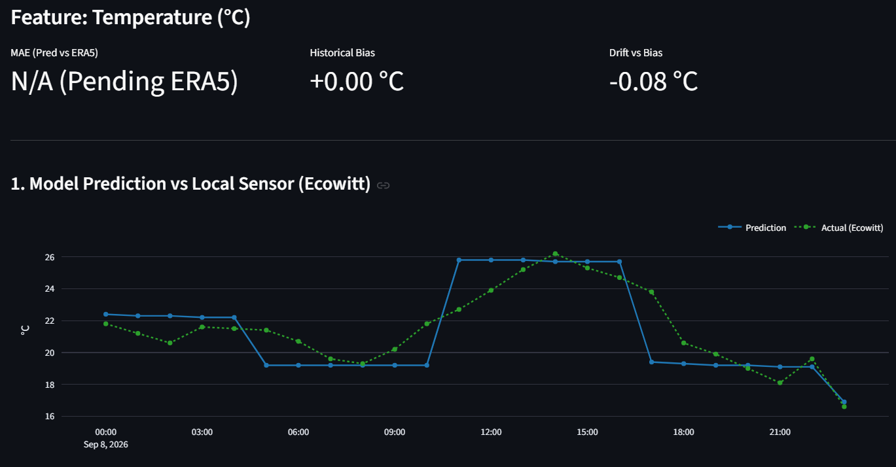

# WAID Case Study: In edge-native operational ML systems, offline edge node failures can halt the continuous inference pipeline. 

When an edge pipeline fails (such as I/O permission locks, power outages, or container write errors) to execute scheduled inference runs, user-facing forecasts become stale, leading to severe metric degradation (observed as artificial **prediction drift**).

The WAID platform handles these operational anomalies through a deterministic **Retroactive Simulation Engine** (`--retroactive`) that steps through historical time windows, re-evaluating inference tensors and overwriting forecast states to reconcile model telemetry with real-world observations.

---

## 🛠️ The Mechanics of Retroactive Execution

When running in retroactive simulation mode, the scheduler isolates execution time by injecting `WAID_MOCK_NOW` at fixed step intervals (`WAID_MOCK_INTERVAL_HOURS=6`).

```bash
# Retroactive simulation execution example
python src/waid_scheduler_lab.py \
  --retroactive \
  --mock-begin "2026-09-08 00:00:00" \
  --mock-end "2026-09-08 23:00:00"

```

### Configuration Parameters

```text
WAID_MOCK_NOW=None
WAID_MOCK_INTERVAL_HOURS=6

```

At each 6-hour interval step, the pipeline:

1. Sets `WAID_MOCK_NOW` to the simulated operational timestamp.
2. Re-evaluates local telemetry (Ecowitt) up to `WAID_MOCK_NOW`.
3. Computes the deterministic solar physics features for the forecast window.
4. Executes the LSTM inference engine to generate a physics-constrained 6-hour forecast horizon.
5. Overwrites/upserts the operational forecast store (`inference_forecast`).
6. Triggers Stage 08 ETL to update the deployment analytics database.

---

## 📊 Operational Comparison: Stale State vs. Reconciled State

A real-world comparison on an ARM board running a containerized Docker pipeline illustrates the impact of write failures and the subsequent retroactive recovery.

### Scenario A: Pipeline Stalled Due to Docker I/O Permission Error

In this scenario, a permission block on the container's volume mount prevented the pipeline from writing new inference steps after 10:00 AM.

* **Behavior:** The prediction curve remained flat and stale, projecting out along the outdated horizon.
* **Impact:** As actual afternoon temperatures peaked at ~25.5 °C, the model prediction remained frozen under 20.0 °C.
* **Drift Metric:** The operational **Drift vs Bias** metric spiked significantly to **-0.92 °C**.

*Figure 1: Stalled inference execution resulting in artificial drift (-0.92 °C).*

---

### Scenario B: Reconciled Pipeline via Retroactive Execution

After resolving the container I/O permissions, the retroactive scheduler was executed across the same 24-hour period (`WAID_MOCK_INTERVAL_HOURS=6`).

* **Behavior:** The scheduler systematically re-stepped through the interval (00:00, 06:00, 12:00, 18:00), generating fresh inference tensors and injecting updated solar physics embeddings at each step.
* **Impact:** The predictions dynamically adapted to each 6-hour step horizon, accurately tracking the diurnal temperature curve recorded by the Ecowitt station.
* **Drift Metric:** The **Drift vs Bias** metric collapsed back down to an optimal **-0.08 °C**, confirming model integrity.

*Figure 2: Fully reconciled forecast state following retroactive re-computation (-0.08 °C).*

---

## 🔑 Key Takeaways & System Guardrails

1. **Drift vs. Failure Differentiation:** A sharp spike in `Drift vs Bias` does not always indicate machine learning model degradation; it often serves as an operational health check alerting to pipeline stall or write blockages.
2. **Deterministic Time Isolation:** Overriding time via `WAID_MOCK_NOW` allows full system backfills without altering host operating system clocks or corrupting database epoch indexes.
3. **Auditability & Dissemination:** By executing the *Stage 08* ETL after a retroactive backfill, public-facing analytics layers (Streamlit Cloud) are seamlessly updated with verified, contiguous historical forecast data.